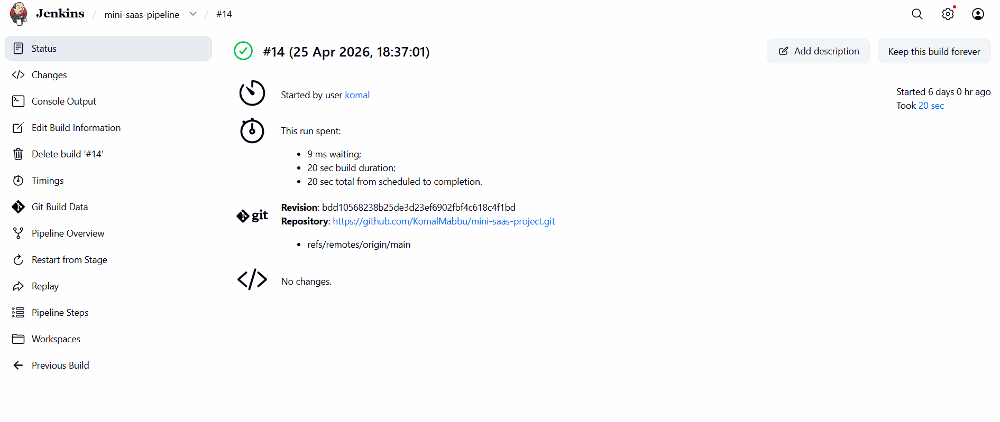
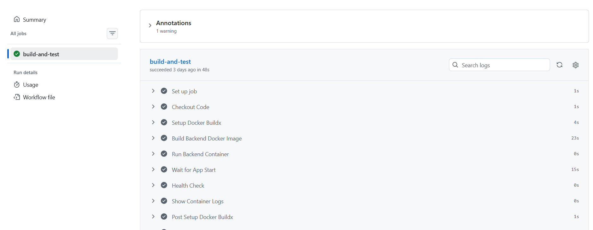
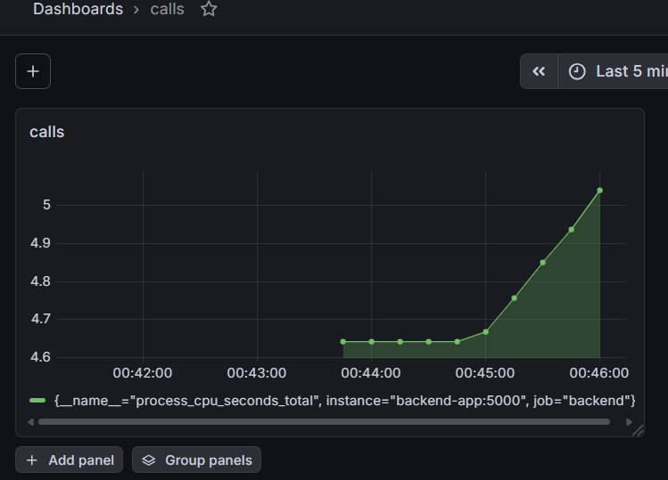
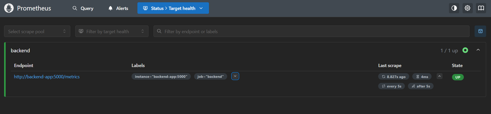
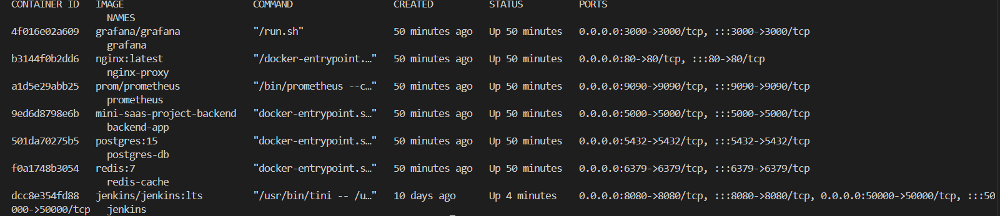

# Mini SaaS DevOps Project

A production-style DevOps project demonstrating CI/CD, Dockerized deployment, reverse proxy setup, database integration, Redis caching, monitoring, and automation using Jenkins, GitHub Actions, Prometheus, and Grafana.

---

## Tech Stack

- Node.js
- Express.js
- PostgreSQL
- Redis
- Docker
- Docker Compose
- Nginx
- Jenkins
- GitHub Actions
- Prometheus
- Grafana

---

## Features

- Dockerized backend deployment
- Nginx reverse proxy setup
- PostgreSQL real database integration
- Redis caching for optimized performance
- Jenkins CI/CD pipeline
- GitHub Actions CI pipeline
- Prometheus metrics monitoring
- Grafana dashboards
- Health check endpoints
- Production-ready project structure

---

## Architecture Diagram

```text
User
  ↓
Nginx Reverse Proxy
  ↓
Node.js Backend
  ↓
PostgreSQL Database
  ↓
Redis Cache

Monitoring:
Prometheus → Grafana
```

---

## Screenshots

### Jenkins Pipeline Success


---

### GitHub Actions CI Success


---

### Grafana Dashboard


---

### Prometheus Targets


---

### Docker Containers Running


---


## Project Structure

```bash
mini-saas-project/
│
├── backend/
│   ├── Dockerfile
│   ├── app.js
│   ├── db.js
│   ├── redis.js
│   ├── package.json
│   └── .env
│
├── nginx/
│   └── default.conf
│
├── prometheus/
│   └── prometheus.yml
│
├── docker-compose.yml
├── Jenkinsfile
├── README.md
│
└── .github/
    └── workflows/
        └── deploy.yml
```

---

## Run Locally

### Clone Repository

```bash
git clone https://github.com/KomalMabbu/mini-saas-project.git
cd mini-saas-project
```

### Start Full Project

```bash
docker compose up -d --build
```

### Stop Full Project

```bash
docker compose down
```

---

## API Endpoints

### GET /health

Health check endpoint

Example Response:

```json
{
  "status": "ok",
  "service": "backend"
}
```

---

### GET /users

Fetch all users

Logic:

- First request → PostgreSQL
- Next requests → Redis Cache

This improves performance and reduces database load.

---

### POST /add-user

Add new user to PostgreSQL

Example Request:

```json
{
  "name": "Komal"
}
```

---

### GET /

Root endpoint

Returns:

```text
Backend API Running
```

---

## Reverse Proxy Access

Access application through Nginx:

```bash
http://localhost
```

instead of directly using backend port.

---

## Monitoring Access

### Prometheus

```bash
http://localhost:9090
```

Used for:

- Application Metrics
- Performance Tracking
- Service Monitoring

---

### Grafana

```bash
http://localhost:3000
```

Default Login:

```text
Username: admin
Password: admin
```

Used for:

- Dashboard Visualization
- CPU Usage
- Memory Usage
- Heap Metrics
- Monitoring Dashboards

---

## CI/CD Pipelines

### Jenkins Pipeline

Automated deployment stages:

- Checkout Code
- Build Docker Image
- Stop Old Container
- Run New Container
- Health Check Validation

Used for production-style deployment automation.

---

### GitHub Actions Pipeline

Runs automatically on every push to:

```text
main branch
```

Pipeline stages:

- Checkout Code
- Setup Node.js
- Install Dependencies
- Start Backend
- Health Check Test

Used for continuous integration and code validation.

---

## PostgreSQL Integration

Real database connection using:

```text
pg package
```

Features:

- Persistent user storage
- Dynamic user creation
- Real production-style DB workflow

---

## Redis Caching

Caching strategy:

### First Request

```text
Fetch from PostgreSQL
```

### Next Requests

```text
Serve from Redis Cache
```

Benefits:

- Faster API response
- Reduced PostgreSQL load
- Better scalability

---

## Prometheus + Grafana Dashboard

Dashboard includes:

- CPU Usage
- Memory Usage
- Heap Metrics
- Service Monitoring
- Backend Performance Visibility

This provides real production-grade monitoring.

---

## Future Improvements

- AWS ECS Deployment
- Terraform Infrastructure as Code
- Kubernetes Deployment
- Blue/Green Deployment Strategy
- Auto Scaling
- Load Balancer Setup
- Secrets Manager Integration
- Production-grade Logging

---

## Author

## Komal Mabbu

DevOps Engineer  
AWS | Docker | Jenkins | GitHub Actions | Terraform | Kubernetes

GitHub:

https://github.com/KomalMabbu

---

## Final Note

This project continues to evolve toward full production-grade SaaS deployment standards.


